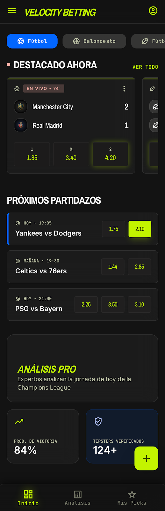

# 🚀 Velocity Betting UI - Listo para GitHub Pages

**Velocity Betting** es un prototipo de interfaz moderna para una plataforma de pronósticos deportivos con inteligencia artificial.



## ✨ Características

- Diseño moderno oscuro con glassmorphism
- Soporte multi-deporte (Fútbol, NBA, NFL, Béisbol, Tenis...)
- Picks con IA y alto porcentaje de confianza
- Panel de administración con carga de Excel
- 6 pantallas completas e interactivas
- Totalmente responsive

## 📁 Estructura

```
velocity_betting_github_ready/
├── index.html          # Inicio (con navegación)
├── admin.html          # Panel Admin + IA
├── mis-picks.html      # Mis Pronósticos
├── metodologia.html    # Metodología IA
├── analisis.html       # Análisis de Partido
├── comunidad.html      # Feed de Expertos
├── assets/screenshots/ # Capturas de referencia
├── design/DESIGN.md    # Sistema de diseño
└── .nojekyll
```

## Estructura del Proyecto

```
velocity_betting_prototype/
├── index.html              # Pantalla de Inicio (Multi-deporte)
├── admin.html              # Panel de Administración + IA
├── mis-picks.html          # Mis Pronósticos y Estadísticas
├── metodologia.html        # Metodología de Análisis IA
├── analisis.html           # Análisis Detallado de Partido
├── comunidad.html          # Feed de Expertos / Comunidad
│
├── assets/
│   └── screenshots/        # Capturas de pantalla de referencia
│       ├── 01-inicio.png
│       ├── 02-admin.png
│       ├── 03-mis-picks.png
│       ├── 04-metodologia.png
│       ├── 05-analisis.png
│       └── 06-comunidad.png
│
├── design/
│   └── DESIGN.md           # Sistema de diseño completo (colores, tipografía, etc.)
│
├── c_digo_fuente_completo_velocity_betting.md
└── proyecto_velocity_betting_c_digo_fuente_final.md
```

## Archivos Principales

| Archivo            | Descripción                                      | Idioma principal |
|--------------------|--------------------------------------------------|------------------|
| `index.html`       | Inicio con partidos en vivo, destacados y próximos | Español         |
| `admin.html`       | Panel admin: subir Excel, análisis IA, Top Picks | Español         |
| `mis-picks.html`   | ROI, racha actual, historial de picks            | Español         |
| `metodologia.html` | Explicación de cómo funciona la IA               | Español         |
| `analisis.html`    | Vista profunda de un partido específico          | Inglés          |
| `comunidad.html`   | Feed de tipsters y expertos verificados          | Español         |

## Cómo usar

1. Abre cualquiera de los archivos `.html` directamente en tu navegador.
2. Todos usan **Tailwind CSS** vía CDN + íconos de Material Symbols.
3. Son **totalmente funcionales** como prototipos interactivos (botones, filtros, etc.).

## Notas

- Se eligieron las versiones más completas y pulidas de cada pantalla.
- El diseño sigue el sistema definido en `design/DESIGN.md` (glassmorphism + lima eléctrico como color primario).
- Este proyecto está listo para ser subido a **GitHub Pages** o integrado en un framework (React, Next.js, etc.).

## 🚀 Cómo subir a GitHub Pages (Gratis y en 2 minutos)

### Paso 1: Crear el repositorio

1. Ve a [github.com/new](https://github.com/new)
2. Nombre del repositorio: `velocity-betting-ui` (o el que prefieras)
3. **NO** marques "Add a README file" (ya lo tenemos)
4. Crea el repositorio

### Paso 2: Subir el código (recomendado)

```bash
# Clona tu nuevo repositorio vacío
git clone https://github.com/TU-USUARIO/velocity-betting-ui.git
cd velocity-betting-ui

# Copia todo el contenido de esta carpeta dentro

# Inicializa y sube
git add .
git commit -m "feat: Velocity Betting UI - Prototipo completo"
git push -u origin main
```

### Paso 3: Activar GitHub Pages

1. Ve a tu repositorio → **Settings** → **Pages**
2. En **Source**, selecciona: `Deploy from a branch`
3. Branch: `main` / Folder: `/ (root)`
4. Haz clic en **Save**
5. Espera 1-2 minutos y tu app estará online en:
   `https://TU-USUARIO.github.io/velocity-betting-ui/`

### Alternativa rápida (sin Git local)

1. Ve a tu repositorio en GitHub
2. Haz clic en **Add file** → **Upload files**
3. Arrastra todas las carpetas y archivos de esta carpeta
4. Commit changes
5. Activa GitHub Pages como en el Paso 3

## 📱 Cómo usar localmente

Simplemente abre el archivo `index.html` en tu navegador.  
Todo funciona sin necesidad de servidor.

## 🎨 Diseño

El sistema de diseño está documentado en `design/DESIGN.md`.

---

**Creado con ❤️ usando Tailwind CSS + Material Symbols**

Proyecto listo para producción o como base para una aplicación real de pronósticos deportivos con IA.
